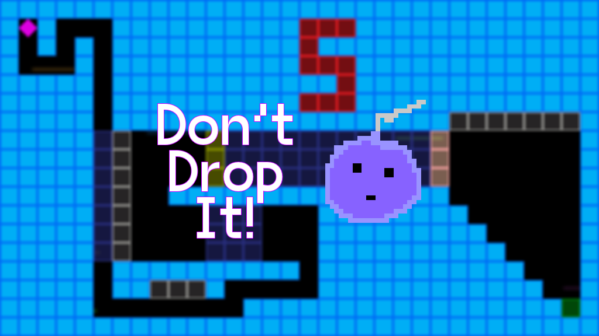

# Don't drop it! - Ludum Dare 49

|             |                                                                                     |
|-------------|-------------------------------------------------------------------------------------|
| **Theme**   | _Unstable_                                                                          |
| **Date**    | _October 2021_                                                                      |
| **Type**    | _Compo_                                                                             |
| **Concept** | _2D skill/puzzle game where you have to destroy a bomb before it does itself._      |

Welcome on my 3rd **Ludum Dare** Compo entry!

The concept is simple: you have to **drag-n-drop** a bomb ready to explode to a safer location.  
Instructions are included in the game, but I warn you, it is **quite challenging**.

If you reach the end without dying once, you may get a _surprise_!

**Software used**:
- Godot Engine 3.3.3 (mono edition) with a few addons of mine,
- sfxia,
- Affinity Photo,
- FL Studio.

**Assets used**:
- VG5000 font (https://gitlab.com/velvetyne/vg5000)

_Good luck, and have fun!_

## Preview

